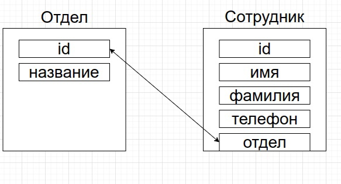

# Name: undefined

## Краткое описание
REST веб-сервис, построенный на Express.js с использованием MongoDB.

## Технологии
Express.js, MongoDB, ESLint, Mongoose

## Запуск
```
Опционально: docker-compose up -d
npm run start
```

## Функционал
[x] Вывод существующего списка сотрудников с возможностью фильтрации

[x] Добавление/удаление/редактирование сотрудников

[x] Назначение сотрудников в отдел

[x] Удаление сотрудника из отдела

[x] Добавление/удаление/редактирование/получение отделов

## Данные в СУБД


Связь: One-To-Many

## Структура проекта
```
    .
    ├── index.js
    ├── src
        ├── db
        |   ├── connect.js
        ├── models
        |   ├── department.js
        |   └── employee.js
        ├── controllers
        |   ├── departments.controller.js
        |   └── employees.controller.js
        ├── routes
            ├── departments.routes.js
            └── employees.routes.js
```

## Я не знаю, как правильно:
1) обрабатывать ошибки
2) делать логи (с декомпозицией в отдельный тред)
